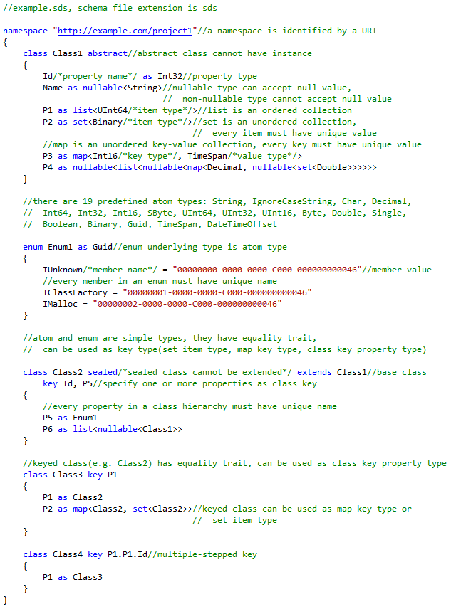

SData is an elegant data interchange solution. It has three parts: schema language, data format and programming language mapping.

Why SData? 1)Schema is the description of data, data is the instance of schema. 2)If schema is used at compile time, a data interchange solution(e.g. Google's Protocol Buffers, Microsoft's Bond, and SData) is statically typed, that is, schema and programming languages are mapped at compile time, the programming language code is intrinsically aware of the data structures and types; otherwise dynamically typed(e.g. JSON), data and programming languages are mapped at run time. Statically typed data interchange solutions have better performance and safety but less flexibility, this is the same difference between statically typed programming language and dynamically typed programming language. 3)SData schema is elegant and powerful, it is object-oriented and has rich types, the programming language mapping mechanism is graceful and flexible, programmers may feel at home when using SData.

## Schema Language

Schema is the description of data.




Type system:

```
Type
  |-GlobalType // namespace member
  |  |-ClassType //syntax: class ClassName [abstract|sealed] [extends BaseClassQualifiableName]
  |  |           // [key PropertyName, PropertyName.PropertyName] { PropertyName as LocalType }
  |  |-SimpleGlobalType
  |    |-AtomType //String, Int32, Boolean, Guid, etc
  |    |-EnumType //syntax: enum EnumName as AtomQualifiableName { MemberName = AtomLiteral }
  |-LocalType
     |-NullableType //syntax: nullable<NonNullableType>
     |-NonNullableType
       |-GlobalTypeRef //syntax: Alias::GlobalTypeName or GlobalTypeName
       |-CollectionType
         |-ListType //syntax: list<LocalType>
         |-SetType //syntax: set<GlobalTypeRef>
         |-MapType //syntax: map<GlobalTypeRef, LocalType>
```

Atom type table:

| Name | Meaning | Literal Examples | 
| ---- | ---- | ---- |
| String | unicode character string | `"normal\r\nstring\u0041\u0042"` `@"verbatim string""123"` |
| IgnoreCaseString | ignore case when comparing value | same as String |
| Char | single unicode character | `'a'` `'\u0041'` |
| Decimal | 128 bit fixed point number, 28 digit precision | `42` `-42.42` `.42` |
| Int64 | 64 bit signed integer | `42` `-42` |
| Int32 | 32 bit signed integer | `42` `-42` |
| Int16 | 16 bit signed integer | `42` `-42` |
| SByte | 8 bit signed integer | `42` `-42` |
| UInt64 | 64 bit unsigned integer | `42` |
| UInt32 | 32 bit unsigned integer | `42` |
| UInt16 | 16 bit unsigned integer | `42` |
| Byte | 8 bit unsigned integer | `42` |
| Double | 64 bit double precision floating point number | `42` `42.42` `-.42E-7` `"INF"` `"-INF"` `"NaN"` |
| Single | 32 bit single precision floating point number | same as Double |
| Boolean | true or false | `true` `false` |
| Binary | byte string | `"AAECAw=="` (base64 encoded) |
| Guid | 128 bit unique number | `"A0E10CD5-BE6C-4DEE-9A5E-F711CD9CB46B"` |
| TimeSpan | duration | `"73.14:08:16.367"` (73 days, 14 hours, 8 minutes and 16.367 seconds) `"-00:00:05"` (minus 5 seconds) |
| DateTimeOffset | date time point | `"2015-01-24T15:32:03.418+07:00"` `"2015-01-01T00:00:00+00:00"` |

### Get Your Hands Dirty!

1) [Visual Studio 2015](http://www.visualstudio.com/downloads/download-visual-studio-vs) is required.

2) Download and install the latest [SData VSIX package(SData-*.vsix)](https://github.com/knat/SData/releases).

3) Open VS 2015, create or open a C# project, unload and edit the .csproj file, insert the following code at the end of the file:

```xml
<!--Begin SData-->
<Import Project="$([System.IO.Directory]::GetFiles($([System.IO.Path]::Combine($([System.Environment]::GetFolderPath(SpecialFolder.LocalApplicationData)), `Microsoft\VisualStudio\14.0\Extensions`)), `SData.targets`, System.IO.SearchOption.AllDirectories))" />
<!--End SData-->
```


5) Reload project, open "Add New Item" dialog box -> Visual C# Items -> SData, create a new SData Schema file, make sure the "Build Action" is set to SDataSchema, write your own schema or copy the following schema into the file:

```
//Biz.sds
namespace "http://example.com/business"
{
    class Person abstract key Id
    {
        Id as Int32
        Name as String
		Phones as list<String>
        RegDate as nullable<DateTimeOffset>
    }

    class Customer extends Person
    {
        Reputation as Reputation
        Orders as nullable<set<Order>>
    }

    enum Reputation as Int32
    {
        None = 0
        Bronze = 1
        Silver = 2
        Gold = 3
        Bad = -1
    }

    class Order key Id
    {
		Id as Int64
        Amount as Decimal
        IsUrgent as Boolean
    }

    class Supplier extends Person
    {
        BankAccount as String
        Products as map<Int32, String>
    }
}

namespace "http://example.com/business/api"
{
    import "http://example.com/business" as biz

    class DataSet
    {
        People as set<Person>
		ETag as Binary
    }
}
```

In building the project, the schema compiler will check the correctness of schema files:


## Data Format

Data is the instance of schema, it is text-based.


## Programming Language Mapping

Map schema to programming languages. Currently only C# is supported, other object-oriented programming languages(Java, C++, etc) are definitely possible.

### Get Your Hands Dirty!

1) Add [SData runtime library NuGet package](https://www.nuget.org/packages/SData) to the project:

```
PM> Install-Package SData -Pre
```

2) In a C# file, use `SData.SchemaNamespaceAttribute` to specify schema-namespace-to-C#-namespace mapping:

```C#
//Program.cs
using SData;

[assembly: SchemaNamespace("http://example.com/business"/*schema namespace URI*/,
                            "Example.Business"/*C# namespace name*/)]
//all schema namespaces must be mapped
[assembly: SchemaNamespace("http://example.com/business/api", "Example.Business.API")]
```

In building the project, after checking the correctness of schema files, the schema compiler will analyze C# files and generate the following C# code in __SDataGenerated.cs:

```C#
//__SDataGenerated.cs. Auto-generated, DO NOT EDIT.

namespace Example.Business
{
    //keyed schema class will implement IEquatable<T>
    public abstract partial class Person : IEquatable<Person>
    {
        public int Id { get; set; }
        public string Name { get; set; }
        public List<string> Phones { get; set; }
        public DateTimeOffset? RegDate { get; set; }
        public Dictionary<string, object> __UnknownProperties { get; set; }
        //try to load and validate data
        public static bool TryLoad(string filePath/*it's just an identifier*/, 
            TextReader reader/*data source!*/, SData.LoadingContext context, out Person result)
        {
            //...
        }
        public void Save(TextWriter writer, string indentString = "\t",
            string newLineString = "\n")
        {
            //...
        }
        public void Save(StringBuilder stringBuilder, string indentString = "\t",
            string newLineString = "\n")
        {
            //...
        }
        //keyed schema class will implement operator == and !=
        public static bool operator ==(Person left, Person right)
        {
            //...
        }
        public static bool operator !=(Person left, Person right)
        {
            //...
        }
        //...
    }

    public static partial class Reputation
    {
        public const int None = 0;
        public const int Bronze = 1;
        public const int Silver = 2;
        public const int Gold = 3;
        public const int Bad = -1;
        //...
    }

    public partial class Customer : Person
    {
        public int Reputation { get; set; }
        public HashSet<Order> Orders { get; set; }
        public static bool TryLoad(string filePath, TextReader reader,
            LoadingContext context, out Customer result)
        {
            //...
        }
        //...
    }

    public partial class Supplier : Person
    {
        public string BankAccount { get; set; }
        public Dictionary<int, string> Products { get; set; }
        public static bool TryLoad(string filePath, TextReader reader,
            LoadingContext context, out Supplier result)
        {
            //...
        }
        //...
    }
    //...
}

namespace Example.Business.API
{
    public partial class DataSet
    {
        public HashSet<Person> People { get; set; }
        public SData.Binary ETag { get; set; }
        public Dictionary<string, object> __UnknownProperties { get; set; }
        public static bool TryLoad(string filePath, TextReader reader,
            LoadingContext context, out DataSet result)
        {
            //...
        }
        public void Save(TextWriter writer, string indentString = "\t",
            string newLineString = "\n")
        {
            //...
        }
        public void Save(StringBuilder stringBuilder, string indentString = "\t",
            string newLineString = "\n")
        {
            //...
        }
        //...
    }
}       
        
public static class SData_ConsoleApplication1
//if the assembly name is 'MyCompany.MyProject', this class name will be
//  'SData_MyCompany_MyProject'
{
    public static void Initialize() { }//Initialize the metadata
    //...
}
```

Type mapping table:

| Schema Type | CLR Type | 
| ---- | ---- |
| String | System.String |
| IgnoreCaseString | SData.IgnoreCaseString |
| Char | System.Char |
| Decimal | System.Decimal |
| Int64 | System.Int64 |
| Int32 | System.Int32 |
| Int16 | System.Int16 |
| SByte | System.SByte |
| UInt64 | System.UInt64 |
| UInt32 | System.UInt32 |
| UInt16 | System.UInt16 |
| Byte | System.Byte |
| Double | System.Double |
| Single | System.Single |
| Boolean | System.Boolean |
| Binary | SData.Binary |
| Guid | System.Guid |
| TimeSpan | System.TimeSpan |
| DateTimeOffset | System.DateTimeOffset |
| `nullable<T>` | `System.Nullable<T>`(if T is CLR value type) or T(if T is CLR ref type) |
| `list<T>` | `System.Collections.Generic.List<T>` |
| `set<T>` | `System.Collections.Generic.HashSet<T>` |
| `map<TKey, TValue>` | `System.Collections.Generic.Dictionary<TKey, TValue>` |

`SData.IgnoreCaseString` is a wrapper of `string`:

```C#
namespace SData
{
    public sealed class IgnoreCaseString : IEquatable<IgnoreCaseString>,
        IComparable<IgnoreCaseString>
    {
        public IgnoreCaseString(string value, bool isReadOnly = false);
        public static implicit operator IgnoreCaseString(string value);
        public static implicit operator string(IgnoreCaseString obj);
        public string Value { get; set; }
        public static bool operator ==(IgnoreCaseString left, IgnoreCaseString right);
        public static bool operator !=(IgnoreCaseString left, IgnoreCaseString right);
        //...
    }
}
```

Usage example:

```C#
IgnoreCaseString ics1 = "abc";
IgnoreCaseString ics2 = "ABC";
Console.WriteLine(ics1 == ics2);//True
string s1 = ics1;//"abc"
string s2 = ics2;//"ABC"
```

`SData.Binary` is a wrapper of `byte[]`:

```C#
namespace SData
{
    public sealed class Binary : IEquatable<Binary>, IList<byte>
    {
        public Binary(byte[] bytes, bool isReadOnly = false);
        public Binary();
        public static implicit operator Binary(byte[] bytes);
        public byte[] ToBytes();
        public byte[] GetBytes(out int count);
        public void AddRange(byte[] array);
        public void InsertRange(int index, byte[] array);
        public static bool operator ==(Binary left, Binary right);
        public static bool operator !=(Binary left, Binary right);
        //...
    }
}
```

Usage example:

```C#
Binary bin1 = new byte[] { 1, 2, 3, 4, 5 };
Binary bin2 = new Binary();
bin2.AddRange(new byte[] { 3, 4, 5 });
bin2.InsertRange(0, new byte[] { 1, 2 });
Console.WriteLine(bin1 == bin2);//True
var s = bin2.ToString();//"AQIDBAU="
byte[] by1 = bin1.ToBytes();
byte[] by2 = bin2.ToBytes();
```

About `SData.LoadingContext` and diagnostics:

```C#
namespace SData
{
    public class LoadingContext
    {
        public LoadingContext();
        public readonly List<Diagnostic> DiagnosticList;
        public bool HasDiagnostics { get; }
        public bool HasErrorDiagnostics { get; }
        public void AddDiagnostic(DiagnosticSeverity severity, int code, string message,
            TextSpan textSpan);
        public virtual void Reset();
    }

    public enum DiagnosticSeverity
    {
        None = 0,
        Error = 1,
        Warning = 2,
        Info = 3
    }

    public struct Diagnostic
    {
        public Diagnostic(DiagnosticSeverity severity, int code, string message,
            TextSpan textSpan);
        public readonly DiagnosticSeverity Severity;
        public readonly int Code;
        public readonly string Message;
        public readonly TextSpan TextSpan;
        //...
    }
}
```

3) Copy the following C# code into Program.cs:

```C#
//Program.cs
using System;
using System.Collections.Generic;
using System.Diagnostics;
using System.IO;
using SData;
using Example.Business;
using Example.Business.API;

[assembly: SchemaNamespace("http://example.com/business", "Example.Business")]
[assembly: SchemaNamespace("http://example.com/business/api", "Example.Business.API")]

class Program
{
    static void Main()
    {
        //IMPORTANT: call SData_Assembly_Name.Initialize() at application startup
        //  to initialize the metadata
        SData_ConsoleApplication1.Initialize();

        var ds = new DataSet
        {
            People = new HashSet<Person>
            {
                new Customer
                {
                    Id = 1, Name = "Tank", RegDate = DateTimeOffset.Now,
                    Phones = new List<string> { "1234567", "2345678"},
                    Reputation = Reputation.Bronze,
                    Orders = new HashSet<Order>
                    {
                        new Order { Id = 1, Amount = 436.99M, IsUrgent = true},
                        new Order { Id = 2, Amount = 98.77M, IsUrgent = false},
                    }
                },
                new Customer
                {
                    Id = 2, Name = "Mike",
                    Phones = new List<string>(),
                    Reputation = Reputation.Gold,
                },
                new Supplier
                {
                    Id = 3, Name = "Eric", RegDate = DateTimeOffset.UtcNow,
                    Phones = new List<string> {"7654321" },
                    BankAccount="11223344", Products = new Dictionary<int, string>
                    {
                        { 1, "Mountain Bike" },
                        { 2, "Road Bike" },
                    }
                }
            },
            ETag = new byte[] { 1, 2, 3, 4, 5, 6, 7, 8 },
        };

        using (var writer = new StreamWriter("DataSet.txt"))
        {
            ds.Save(writer, "    ", "\r\n");
        }

        DataSet result;
        var context = new LoadingContext();
        using (var reader = new StreamReader("DataSet.txt"))
        {
            if (!DataSet.TryLoad("**DataSet.txt**", //it's just an identifier
                reader, context, out result))
            {
                foreach (var diag in context.DiagnosticList)
                {
                    Console.WriteLine(diag.ToString());
                }
                Debug.Assert(false);
            }
        }
        context.Reset();//after calling Reset(), context object can be reused
    }
}
```

After running the program, open DataSet.txt to view the content. Set a breakpoint at line `var context = new LoadingContext();`, after the program hits the breakpoint, open DataSet.txt, invalidate any data you want, for example, delete line `Name = @"Tank",`, because property `Name`'s type is non-nullable, that is, the property is required, `TryLoad()` will fail and the following diagnostic string will write to console:

```
Error -293: Property 'Name' missing.
    **DataSet.txt**: (23,9)-(23,9)
```

4) Because every generated class is marked with `partial` modifier, user code can be added to it:

```C#
//my.cs
namespace Example.Business
{
    partial class Person : SomeClass, ISomeInterface
    {
        public int MyProperty { get; set; }
        public abstract void MyMethod();
    }

    partial class Customer
    {
        //NOTE: parameterless constructor is required for non-abstract class.
        public override void MyMethod() { }
    }
}
```

5) Customer validation can be added:

```C#
//my.cs
using System;
using SData;

public class MyLoadingContext : LoadingContext
{
    public bool CheckCustomerReputation { get; set; }
    public override void Reset()
    {
        base.Reset();
        //...
    }
}

public enum MyDiagnosticCode
{
    PhonesIsEmpty = 1,//user code must be greater than zero
    BadReputationCustomer,
}

namespace Example.Business
{
    partial class Person
    {
        //OnLoading() is called by the serializer just after the object is created
        private bool OnLoading(LoadingContext context, TextSpan textSpan)
        {
            Console.WriteLine("Person.OnLoading()");
            return true;
        }
        //OnLoaded() is called just after all properties are set
        private bool OnLoaded(LoadingContext context, TextSpan textSpan)
        {
            Console.WriteLine("Person.OnLoaded()");
            if (Phones.Count == 0)
            {
                context.AddDiagnostic(DiagnosticSeverity.Error,
                    (int)MyDiagnosticCode.PhonesIsEmpty, "Phones is empty.", textSpan);
                return false;
            }
            return true;
//if error diagnostics are added to the context, the method must return false.
//if any OnLoading() or OnLoaded() returns false, TryLoad() will return false immediately 
        }
    }

    partial class Customer
    {
        //the serializer will call base method(Person.OnLoading()) first
        private bool OnLoading(LoadingContext context, TextSpan textSpan)
        {
            Console.WriteLine("Customer.OnLoading()");
            return true;
        }
        //the serializer will call base method(Person.OnLoaded()) first
        private bool OnLoaded(LoadingContext context, TextSpan textSpan)
        {
            Console.WriteLine("Customer.OnLoaded()");
            var myContext = (MyLoadingContext)context;
            if (myContext.CheckCustomerReputation && Reputation == Business.Reputation.Bad)
            {
                context.AddDiagnostic(DiagnosticSeverity.Warning,
                    (int)MyDiagnosticCode.BadReputationCustomer, "Bad reputation customer.",
                    textSpan);
//if non-error diagnostics are added to the context, the method should return true.
            }
            return true;
        }
    }
}
```

```C#
//Program.cs
        //...
        var context = new MyLoadingContext() { CheckCustomerReputation = true };
        using (var reader = new StreamReader("DataSet.txt"))
        {
            if (!DataSet.TryLoad("**DataSet.txt**", reader, context, out result))
            //...
```

6) Use `SData.SchemaClassAttribute` to map schema class to C# class explicitly, use `SData.SchemaPropertyAttribute` to map schema property to C# property/field explicitly. The schema compiler is aware of these attributes.

```C#
//my.cs
using System;
using System.Collections.Generic;
using System.Collections.ObjectModel;
using SData;

namespace Example.Business
{
    [SchemaClass("Person"/*schema class name*/)]
    partial class Contact
    {
        [SchemaProperty("RegDate"/*schema property name*/)]
        public DateTimeOffset? RegistrationDate { get; internal set; }

        //same-named schema property and C# property/field are mapped implicitly
        public string Name { get; internal set; }

        [SchemaProperty("Phones")]
        private Collection<string> _phones;
        public Collection<string> Phones
        {
            get { return _phones ?? (_phones = new Collection<string>()); }
        }
//list<T> can be mapped to System.Collections.Generic.ICollection<T> or implementing class
//set<T> can be mapped to System.Collections.Generic.ISet<T> or implementing class
//map<TKey, TValue> can be mapped to System.Collections.Generic.IDictionary<TKey, TValue>
//  or implementing class
    }

    //same-named schema class and C# class are mapped implicitly
    partial class Supplier
    {
        public IDictionary<int, string> Products { get; internal set; }
    }
}

namespace Example.Business.API
{
    partial class DataSet
    {
        [SchemaProperty("People")]
        public ISet<Contact> Contacts { get; set; }
    }
}
```

`SData.SchemaNamespaceAttribute`, `SData.SchemaClassAttribute` and `SData.SchemaPropertyAttribute` are compile-time attributes, they have nothing to do with runtime. Yeah, welcome to the metaprogramming world.

7) Suppose Biz.sds is mapped in assembly ClassLibrary1, some months later, Administrator is added:

```
//Biz2.sds

namespace "http://example.com/business2"
{
	import "http://example.com/business"

    class Administrator extends Person
    {
        //...
    }
}
```

In project ClassLibrary2, both Biz.sds and Biz2.sds are added to it. Can we reuse the code in assembly ClassLibrary1? Yes, add assembly ClassLibrary1.dll to project ClassLibrary2, and only "http://example.com/business2" need to be mapped:

```
[assembly: SchemaNamespace("http://example.com/business2", "Example.Business2")]
```

## License

The MIT License.

## Questions, suggestions or contributions are welcomed

## Appendix A: Lexical grammar of data

```
white-space:
unicode-category-Zs | '\u0009' | '\u000B' | '\u000C'
;
new-line:
'\u000D' | '\u000A' | '\u0085' | '\u2028' | '\u2029'
;
white-space-or-new-line-token:
(white-space | new-line)+
;
single-line-comment-token:
'//' (!new-line)*
;
delimited-comment-token:
'/*' (!'*/')* '*/'
; 
name-token:
normal-name-token | verbatim-name-token
;
verbatim-name-token:
'@' normal-name-token
;
normal-name-token:
name-start-char name-part-char*
;
name-start-char:
letter-char | '_'
;
name-part-char:
letter-char | decimal-digit-char | connecting-char | combining-char | formatting-char
;
letter-char:
unicode-category-Lu-Ll-Lt-Lm-Lo-Nl
;
decimal-digit-char:
unicode-category-Nd
;
connecting-char:
unicode-category-Pc
;
combining-char:
unicode-category-Mn-Mc
;
formatting-char:
unicode-category-Cf
;
string-value-token:
normal-string-value-token | verbatim-string-value-token
;
normal-string-value-token:
'"' normal-string-value-char* '"'
;
normal-string-value-char:
!('"' | '\\' | new-line) | simple-escape-sequence | unicode-escape-sequence
;
simple-escape-sequence:
'\\' ('\'' | '"' | '\\' | '0' | 'a' | 'b' | 'f' | 'n' | 'r' | 't' | 'v')
;
unicode-escape-sequence:
'\\u' hex-digit hex-digit hex-digit hex-digit
;
hex-digit:
'0'..'9' | 'A'..'F' | 'a'..'f'
;
verbatim-string-value-token:
'@"' (!'"' | '""')* '"'
;
char-value-token:
'\'' char-value-char '\''
;
char-value-char:
!('\'' | '\\' | new-line) | simple-escape-sequence | unicode-escape-sequence
;
integer-value-token:
('+' | '-')? decimal-digit+
;
decimal-digit:
'0'..'9'
;
decimal-value-token:
('+' | '-')? decimal-digit* '.' decimal-digit+
;
real-value-token:
('+' | '-')? (decimal-digit* '.')? decimal-digit+ ('E' | 'e') ('+' | '-')? decimal-digit+
;
hash-open-bracket-token:
'#['
;
colon-colon-token:
'::'
;
character-token:
a-single-character-not-recognized-by-the-above-rules
;
```

## Appendix B: Parsing grammar of data

```
parsing-unit:
class-value
;
class-value:
alias-uri-list? type-indicator? '{' (property (',' property)* ','?)? '}'
;
alias-uri-list:
'<' (alias-uri (',' alias-uri)* ','?)? '>'
;
alias-uri:
name-token '=' string-value-token
;
type-indicator:
'(' qualified-name ')'
;
qualified-name:
name-token colon-colon-token name-token
;
property:
name-token '=' value
;
value:
null-value | atom-value | enum-value | list-or-set-value | map-value | class-value
;
null-value:
'null'
;
atom-value:
string-value-token | char-value-token | integer-value-token | decimal-value-token
    | real-value-token | 'true' | 'false'
;
enum-value:
qualified-name '.' name-token
;
list-or-set-value:
'[' (value (',' value)* ',')? ']'
;
map-value:
hash-open-bracket-token (key-value (',' key-value)* ','?)? ']'
;
key-value:
value '=' value
;
```

## Appendix C: Lexical grammar of schema

Same as lexical grammar of data.

## Appendix D: Parsing grammar of schema

```
compilation-unit:
namespace*
;
namespace:
'namespace' string-value-token '{' import* global-type* '}'
;
import:
'import' string-value-token ('as' name-token)?
;
qualifiable-name:
(name-token colon-colon-token)? name-token
;
global-type:
class-type | enum-type
;
enum-type:
'enum' name-token 'as' qualifiable-name '{' enum-member* '}'
;
enum-member:
name-token '=' atom-value
;
atom-value:
string-value-token | char-value-token | integer-value-token | decimal-value-token
    | real-value-token | 'true' | 'false'
;
class-type:
'class' name-token ('abstract' | 'sealed')? ('extends' qualifiable-name)?
    ('key' key (',' key)*)? '{' property* '}'
;
key:
name-token ('.' name-token)*
;
property:
name-token 'as' local-type
;
local-type:
nullable-type | non-nullable-type
;
nullable-type:
'nullable' '<' non-nullable-type '>'
;
non-nullable-type:
global-type-ref | list-type | set-type | map-type
;
global-type-ref:
qualifiable-name
;
list-type:
'list' '<' local-type '>'
;
set-type:
'set' '<' global-type-ref '>'
;
map-type:
'map' '<' global-type-ref ',' local-type '>'
;
```
